# mdb-atlas-workshop-july2019
This repository contains a guide on getting started with MongoDB.  Specifically, this is
a step-by-step tutorial/workshop incorporating the use of [MongoDB Atlas](https://www.mongodb.com/cloud/atlas),
[MongoDB Compass](https://www.mongodb.com/products/compass), [MongoDB Stitch](https://www.mongodb.com/cloud/stitch), 
and [MongoDB Charts](https://www.mongodb.com/products/charts).  
The data that will be utilized in this workshop
will be one of the sample data sets that can be loaded into MongoDB Atlas via the
click of a button.

---
## Introduction to MongoDB and MongoDB Atlas
### Hands-on Workshop
#### Overview
This hands-on workshop is designed to get you familiar with all general aspects of
MongoDB and MongoDB Atlas.  However, the general focus will be on utilizing the capabilities
of MongoDB Atlas.  The exercises will include basic query capabilities, introduction
to the aggregation framework, query optimization, and schema validation through the
use of MongoDB Compass.  The exercises will then transition into building applications
using MongoDB Stitch through the use of [Stitch Functions](https://docs.mongodb.com/stitch/functions/) 
and [Stitch Triggers](https://docs.mongodb.com/stitch/triggers/).  Finally, the workshop
will conclude with a set of exercises to introduce the user to MongoDB Charts.

### Required Prerequisites
To successfully complete this workshop, the following steps should be completed:
* To use MongoDB Atlas, you **must** be able to make outgoing requests from your computer
to MongoDB Atlas services which will be running on port 27017.  Please confirm that port
27017 is not blocked by checking with [PortQuiz](http://portquiz.net:27017/).

* Complete [Getting Started with MongoDB Atlas](https://docs.atlas.mongodb.com/getting-started/). This involves creating an Atlas account, creating your first
free tier cluster, and setting up the appropriate security credentials

* Load Sample data into your cluster by following the [Insert Data into Your Cluster](https://docs.atlas.mongodb.com/getting-started/#insert-data-into-your-cluster)
section of the Getting Started Guide.

* Download/Install [MongoDB Compass](https://www.mongodb.com/products/compass).

* Verify the sample databases/collections have been successfully loaded into your
MongoDB Atlas cluster by using either MongoDB Compass or the [Data Explorer](https://docs.atlas.mongodb.com/data-explorer/index.html)
tool that is part of the MongoDB Atlas User Interface.

#### Important Note:
As you walk through the exercises, you will have the option of interfacing with the data
that is stored in MongoDB Atlas through a number of tools.  Several of the MongoDB Stitch
exercises will be utilizing a microservices style architecture by making calls via
a REST API.  For these examples you can use [curl](https://curl.haxx.se/download.html) or
[Postman](https://www.getpostman.com/).

---
### Outline of Workshop:
1. MongoDB Compass
    * Basic Find Queries
    * Evaluate query performance and indexes
    * Aggregation Framework
    
2. Part 1 - MongoDB Stitch (Microservices)
    * GET/POST operations via webhooks
    * Triggers
    
3. Part 2 - MongoDB Stitch (Control Data Access via Rules)
    * MongoDB Rules
    * Query Anywhere
    * Stitch Hosting
    
4. MongoDB Charts
    * General Charts Demonstration
    
5. Code Samples
    * Variety of code examples in Python, Node.js, and C#
    
   
---
### MongoDB Compass Lab
#### Lab 1 - Connect to your cluster in MongoDB Atlas
If you have completed the steps above, we can now copy the connection string and
connect Compass to our cluster.  Within the Atlas UI, in the Clusters view, click
the *Connect* button.  This will bring up a pop-up window where you can select how
to connect to your Atlas Cluster.  Select the option *Connect with MongoDB Compass*.
The image below should provide an idea on what you should see:

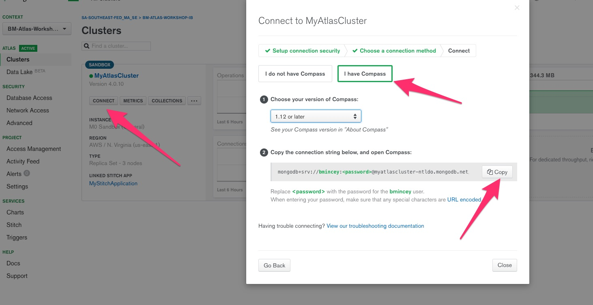  

Be sure to select that you already have Compass and select the latest version which is
indicated by *1.12 or later*.  Then, copy your connection string.  When you now open
or point to MongoDB Compass, it will read your copy buffer and you can easily paste
this into MongoDB Compass.  All you should have to do is enter your password you used
when you first created a MongoDB Atlas database user or Atlas admin user.  Be sure
to select to save this as a favorite as this makes it much quicker to open the cluster
up after closing Compass.

Once you are in Compass and connected to Atlas, you should see a view simiar to that below:

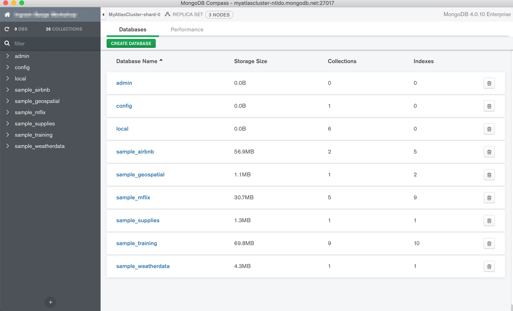

#### Lab 2 - Browse documents
Click the *sample_mflix* database to open up a series of collections.  Then, select
the *theaters* collection. It should have a list of the documents in this collection
similar to that below:

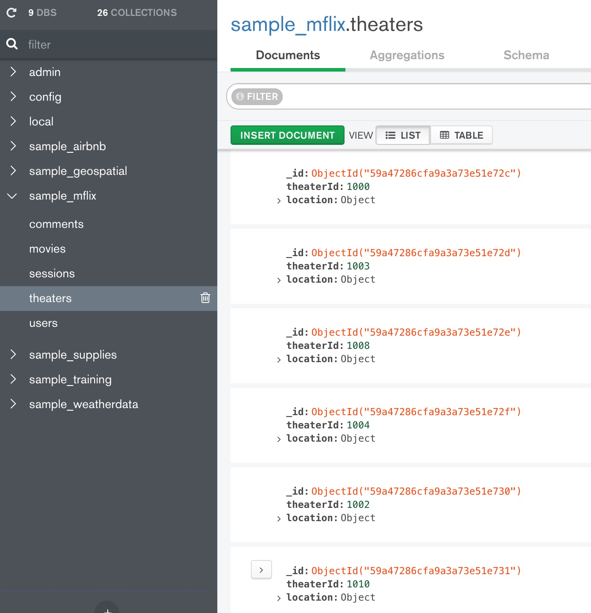

There is simply an _id field, a theaterId field, and a location object.  Wait, did we
just store and object in the database?  We can expand the location field/object and
see that it is storing an address and embedding yet another object for its geolocation.
Working with data in this way, it is much easier than having to flatten out multiple
tables from a relational/tabular model into a single object.

#### Lab 3 - Analyze the Schema
Analyze the schema???  Wait, I thought that MongoDB was a NoSQL database and was considered
to be schema-less?  While that is technically true, no dataset would be of any use
without the notion or concept of a schema.  Although MongoDB does not enforce a schema,
your collections of documents will still always have one.  The key difference with MongoDB
is that the schema can be flexible/polymorphic.

Within MongoDB Compass, select the *Schema* tab and click *Analyze Schema*.  Compass
will sample the documents in the collection to derive a schema.  In addition to providing,
field names and types, Compass will also provide a summary of the data values and their
distribution.  

After you click *Analyze Schema*, if you look at the *location* field, you will notice
that it contains a *geo* field with GeoJSON coordinates, i.e. a longitude and latitude coordinate.
You can drill down on the map as it builds the query for you.  It should look similar
to the image below:

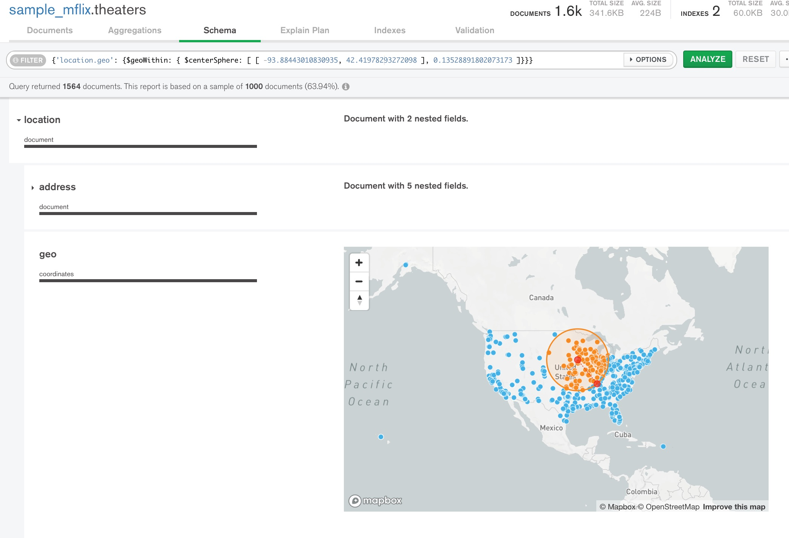  

#### Lab 4 - Query Data with MongoDB Compass (CRUD Operations)
Simply copy the code block for each section below and paste within the filter
dialog in MongoDB Compass as indicated below:

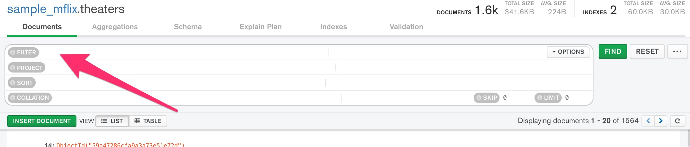  

##### Find Operations  

* Simple filter (specific name in sample_mflix.comments collection)
```
{ name : "Ned Stark" }
```

* Simple filter with query operators (email that ends in fakegmail.com and comment made since 2017 in sample_flix.comments)
```
{ email: /fakegmail.com$/ , date : {$gte : ISODate('2017-01-01')}}  
```

* Query sub-document/array  (movies with more than 10 wins in sample_mflix.movies)
```
{"awards.wins" : {$gt : 10}}
```

* Query using the $in operator (Movies in Arabic or Welsh in sample_mflix.movies)
```
{languages : {$in : ["Arabic", "Welsh"]}}
```

* Only movies in Arabic
```
{languages : ["Arabic"] }
``` 

* Movies in BOTH Arabic and Spanish
```
{languages : { $all : ["Arabic", "Spanish"]}}
```

* Movies with IMDB Rating > 8.0 and PG Rating
```
{"imdb.rating": {$gt : 8.0 }, rated : "PG"}
```

* Movies with Title starting with "Dr. Strangelove"
```
{ title : /^Dr. Strangelove/ }
```

##### Update, Delete, Clone Operations
Find a document in any collection and choose to update a field or fields.  In fact,
you can select to add a field that does not exist.  Next, clone a document.  Then,
delete the cloned document.  MongoDB Compass provides all the CRUD controls you
will need.  Below is a sample image displaying where this capability is:


#### Lab 5 - Create indexes to improve efficiency of queries - Part 1
Indexes support the efficient execution of queries in MongoDB.  Without indexes,
MongoDB must perform a *collection scan*, i.e., scan every document in a collection
to select those documents that match the query statement.  If an appropriate
index exists for a query, MongoDB can use the index to limit the number of documents
it must inspect.

In this lab, we will perform a search on a field, use the explain plan to determine
if it could be improved with an index, and create the index...all from within MongoDB Compass.

For this lab, we will execute a query to find all movies with at least Drama as a genre.

In the query box, enter:
```
{genres : "Drama" }
```

Then, click the Explain Plan tab as below:

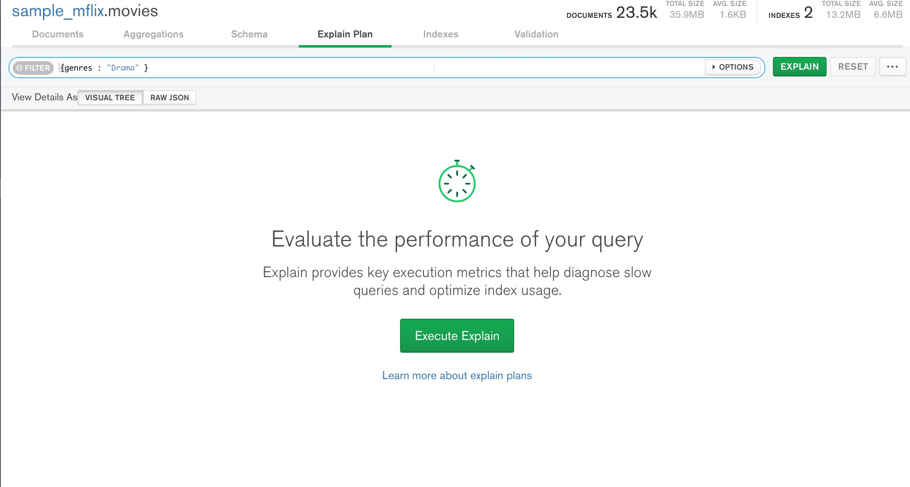  

Click the *Execute Explain* button in the middle of the GUI and review the output.

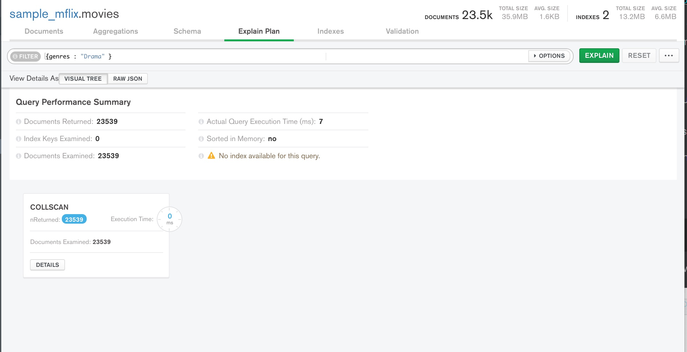  

Considering this is a relatively small data size, an index may not immediately improve
performance.  In our results, it indicates a *collection scan* took place with our filter.
It also indicates that it took 7 milliseconds to execute.

Click on the indexes tab.  We will create an index on *genres*.  Find the field in the
dropdown and select 'asc' as the index type.  Then, click the create button as below:

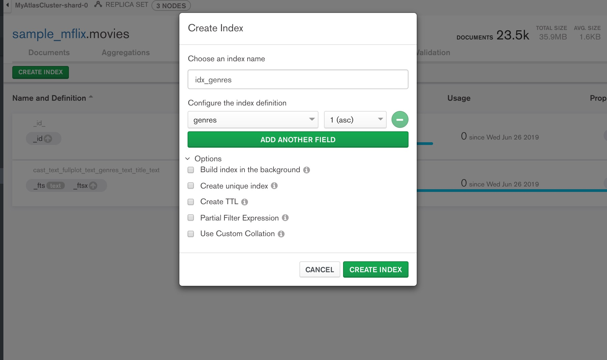  

After creating the index, go back to your Explain Plan tab and *Execute Explain* once more.
This time, you should see that your index was hit and instead of a collection scan, your
filter performed an index scan.  Your results should look similar to below:

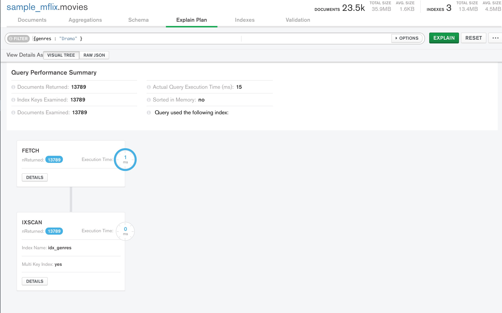  

#### Indexes - Part 2
Now, try the following query:
```
{released : {$gte : ISODate('2010-01-01')}, rated : 'R'}
```
**Be sure to sort this query with the following:**
```
{"imdb.rating" : 1 }
```

After executing the query, try to run an *Explain Plan* on it.  It should look
like the following:

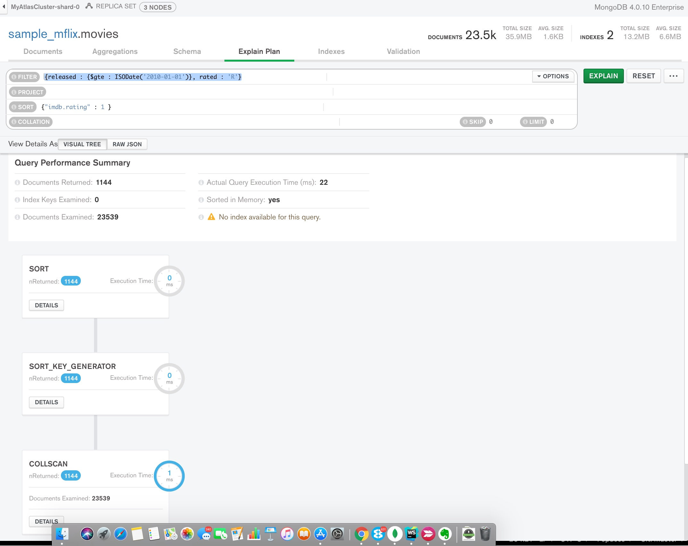  

Any ideas or suggestions on a possible index?  Based on our query, the first
thought may be to create an ascending index on released, rated, and imdb.rating.
You can try this in fact and see the results.  It should resemble this below:

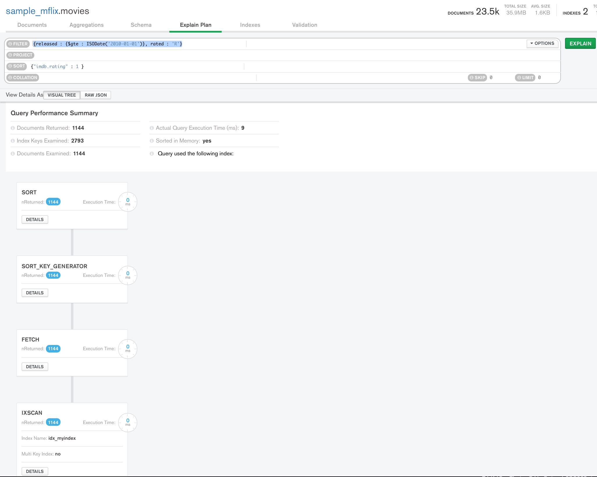  

However, the general rule of thumb is to remember: Equality, Sort, and Range. Consider
that we are matching exactly on rated.  Then, we sort on the imdb.rating.  Finally,
our range is the released date.  Delete the previously created index.  Let's try this now by creating an ascending index
in the order of rated, imdb.rating, and the released fields.  It should look like below:

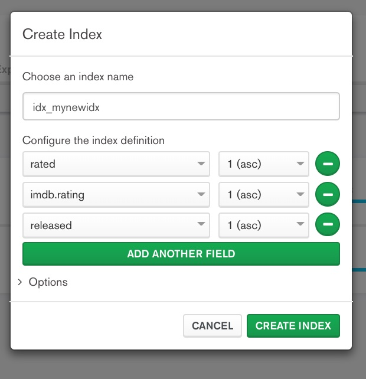  

Go back to the *Explain Plan* tab and let's see the new results:

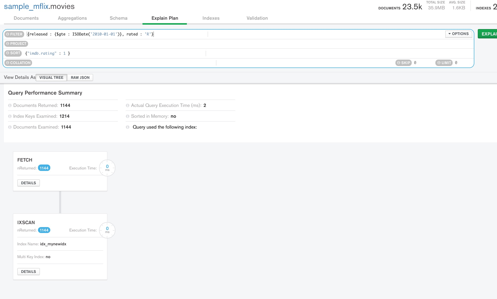  

This is a great rule of thumb:  Equality, Sort, Range!

#### Lab 6 - Aggregation Framework
MongoDB's [aggregation framework](https://docs.mongodb.com/manual/core/aggregation-pipeline/) is modeled
on the concept of data processing pipelines.  Documents enter a multi-state pipeline
that transforms the documents into an aggregated result.  The most basic pipeline stages
provide filters that operate like queries and document transformations that modify the
form of the output document.  Other pipeline operations provide tools for grouping and
sorting documents by specific field or fields as well as tools for aggregating the 
contents of arrays, including arrays of documents. In addition, pipeline stages can 
use operators for tasks such as calculating the average or concatenating a string.  The
pipeline provides efficient data aggregation using native operations within MongoDB, 
and is the preferred method for data aggregation in MongoDB.

For our next exercise, we will use the aggregation pipeline builder in MongoDB Compass to
create our aggregation pipelines.

Let's say we have been tasked with determining the most popular genres that have been produced
in the USA, Germany, and France since 2000.  Click on the *Aggregations* tab and select
*New Pipeline* dialog.  It should look like this below:

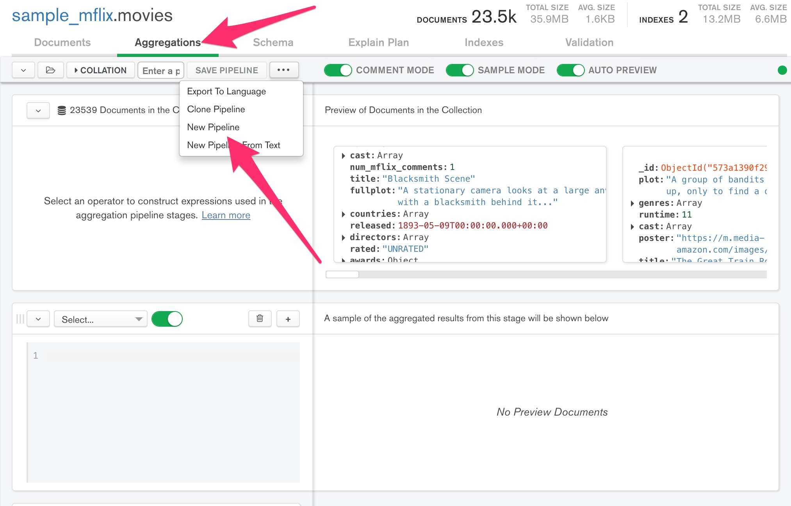  

First, our aggregation will need to filter for movies with a country of *only*
the USA, France, or Germany and have been produced since the year 2000.  
This will be done with a "$match" operation.

In the first stage of the pipeline builder, select *$match* from the dropdown and
paste the following:

```
{
  countries : ["USA", "Germany", "France"],
  year : {$gt : 2000 }
}
```

You will notice that a preview of sample documents is on the right-hand side
of the builder.  Now, we want to *unwind* the genres array as we want to count
the most popular arrays.  The next stage will be an unwind operation on genres. Paste
this in the next stage:
```
{
    path: "$genres"
}
```

Now, we will want to group by the genres and count them.  This is done with the
$group operator and the $sum operator.  Copy/Paste the snippet below into the next
stage:
```
{
  _id: "$genres",
  genre: {
    $sum: 1
  }
}
```

Next, we want to sort the result in *descending* fashion so the most popular
genre is the first element of our result.  Can you figure out how to do that?

Your final pipeline will be the following:

```
[
    {
        $match: {
            countries : ["USA", "Germany", "France"],
            year : {$gt : 2000 } }}, 
        { $unwind: { path: "$genres" }}, 
        { $group: { _id: "$genres",
                   genre: { $sum: 1 } }}, 
        { $sort: { "genre": -1 }
    }
]
```
You can choose to save this pipeline if you would like to open it later.

---
### MongoDB Stitch Labs
#### Lab 1 - Microservices with MongoDB Stitch
For the next series of exercises, continue to use the same cluster you
have just created.  You will be creating your first Stitch Application that
will be using the same database and collection for the previous labs.

For the complete set of steps, please reference the Github repository
for [Stitch Microservices](https://github.com/blainemincey/stitch-microservices-mdbw2019). 

#### Lab 2 - Controlling Access to Data using Rules with MongoDB Stitch
For the next series of exercises, continue to use the same cluster you
have just created.  You will be "adding on" to the Stitch Application that
you have created in the prior lab for microservices.

For the complete set of steps, please reference the Github repository
for [Stitch Rules and Stitch Query Anywhere](https://github.com/blainemincey/stitch-rules-mdbw2019).

#### Lab 3 - Stitch Hosting
Stitch Hosting allows you to host, manage, and serve your application’s static media 
and document files. You can use Hosting to store individual pieces of content 
or to upload and serve your entire client application.

Follow the MongoDB Stitch documentation for [Hosting](https://docs.mongodb.com/stitch/hosting/).

---
### MongoDB Charts
MongoDB Charts is the best way to create visualizations of MongoDB data. 
Connect to any MongoDB instance as a data source, create charts and graphs, 
embed them into your applications or build live dashboards for sharing 
and collaboration.

This lab follows a subset of the steps that are provided in the MongoDB Documentation for the
MongoDB Charts Tutorial for [Visualizing Movie Details](https://docs.mongodb.com/charts/master/tutorial/movie-details/movie-details-tutorial-overview/).

#### Lab 1 - Create a MongoDB Chart
You will first need to launch MongoDB Charts for the left navigation pane in MongoDB
Atlas as indicated below:

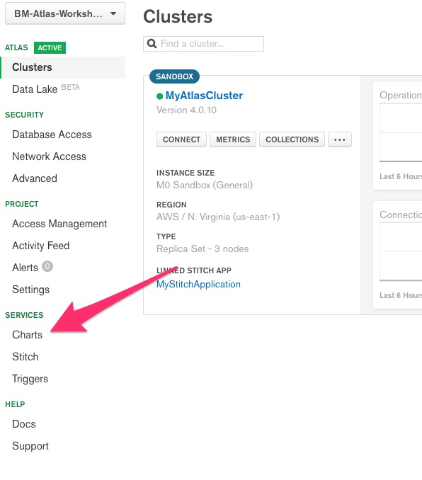  

Once the UI loads for Charts, you will then need to click the Data Sources Tab:

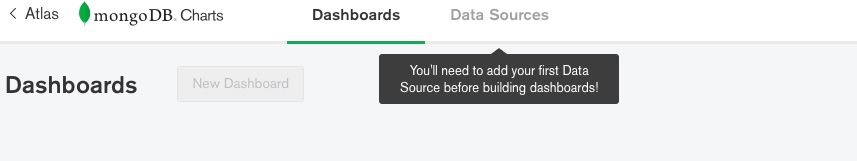  

In the Data Sources View, you will then add a New Data Source as below:

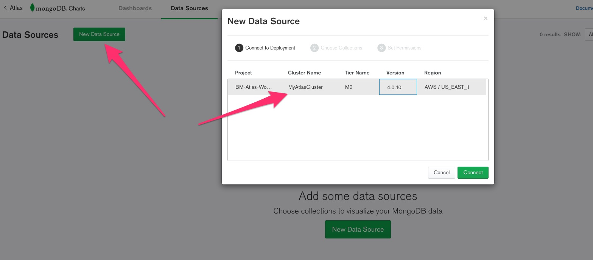  

After you click *Connect*, it may take about a minute before it actually connects.

After connecting, you will then select the *sample_mflix* database that we have 
been using and we will also select each collection in the database.

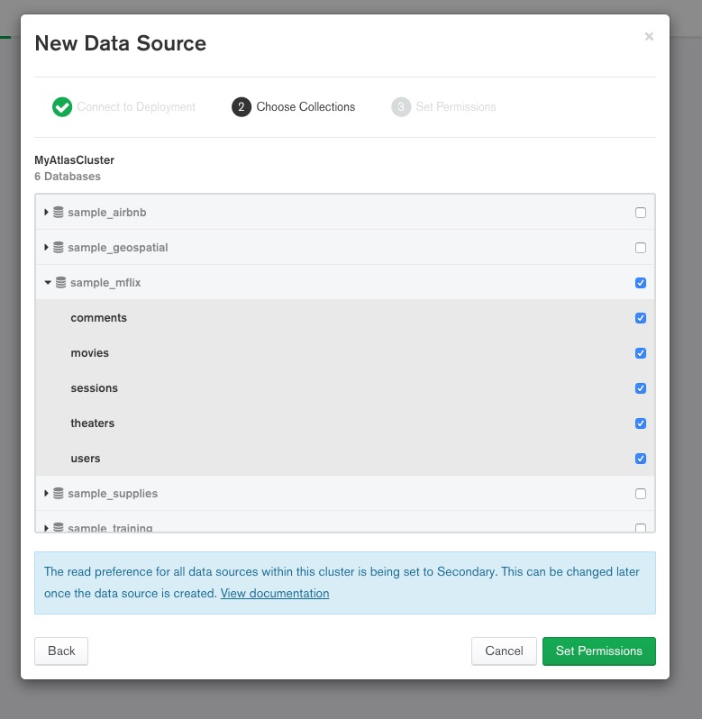  

Now, click the *Set Permissions* button.  Leave all of the default selections and click
the *Publish Data Source* button.  You should have successfully established the data
source in charts.  Now, we will create a *New Dashboard*.

Click the *Dashboards* tab which should be indicated similar to the image below:

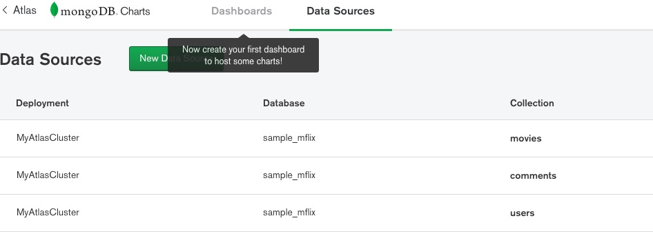  

Click the *New Dashboard* button and add a Title and a Description to your dashboard.
It should look similar to that below:

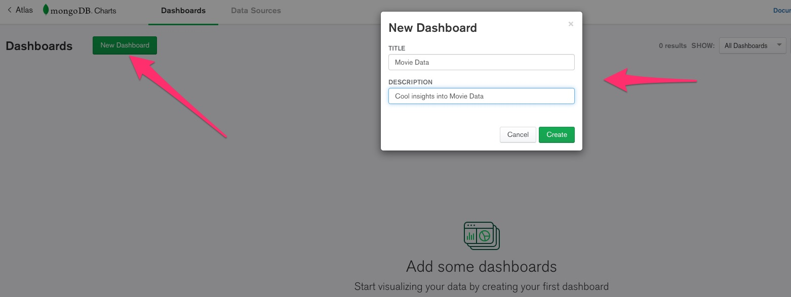  

Now, we will create our first chart.  Click the *Add Chart* button.
Next, we will need to select the *sample_mflix.movies* data.  Next, select
the Chart Type as Column.  Select the panel labeled Stacked below the Chart Type
menu.  It should look like the image below:

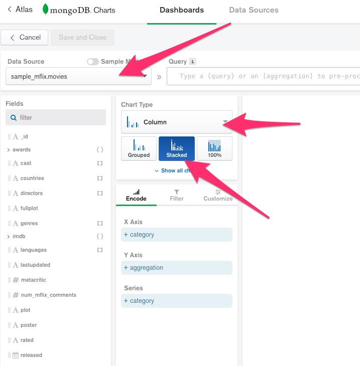  

* Drag the directors field from the Fields section of the Chart Builder view to 
the X Axis encoding channel.

* In the directors Array Reductions dropdown, select Unwind Array.

* In the Fields section click the awards field to expand the awards object and 
view its properties.  

* Drag the awards.wins field to the Y Axis encoding channel. 
The Y Axis encoding channel determines which field to use for the chart’s aggregation.

* Leave the Aggregate dropdown menu for the Y Axis encoding channel on its default value of sum. 
This value directs the aggregation operation to return the total number of award wins for each director.

* Limit the *directors* array should be limited to 10.

* Group the awards by *genre*.  For Array Reduction on the Series encoding channel,
select *unwind array*.

* Title the chart: Directors with Most Awards, Split by Genre

Prior to saving and closing the chart, it should look like that below:

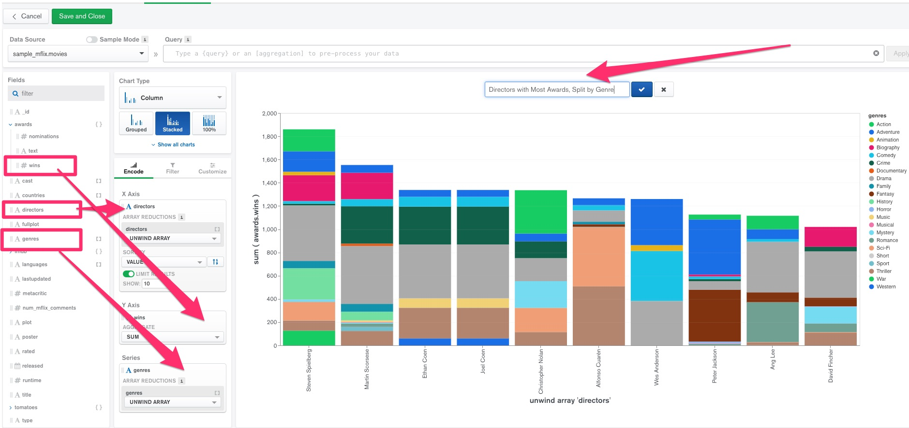  

#### Lab 2 - Scatter Chart
add a chart to your dashboard showing the TomatoMeter rating and MPAA rating of 
movies with the most award nominations. A scatter chart is a good choice for 
visualizing how data points cluster together around certain values and 
allows the representation of several different data dimensions.

In the upper-right of the Charts UI, select *Add Chart*.  For the Data Source
we will once again use sample_mflix.movies.  Select the Chart Type as Grid and
select the Scatter panel below the dropdown menu.  Your screen should look like
that below:

  

* In the Fields section, click the tomatoes field to expand the tomatoes object 
and view its properties.

* Click the tomatoes.critic field to also expand that object.

* Drag the tomatoes.critic.rating field to the X Axis encoding channel.

* In the Fields section click the awards field to expand the awards object and 
view its properties.

* Drag the awards.nominations field to the Y Axis encoding channel.

* Add a query filter for only movies with at least 30 award nominations and 
marginal MPAA Ratings.  In the Filters box, add the following query and apply:
```
{"awards.nominations": {$gte: 30}, rated: {$in: ["G", "PG", "PG-13", "R"]}}
```
* Drag the rated field to the Color encoding channel.

Your chart prior to saving, should look like that below:

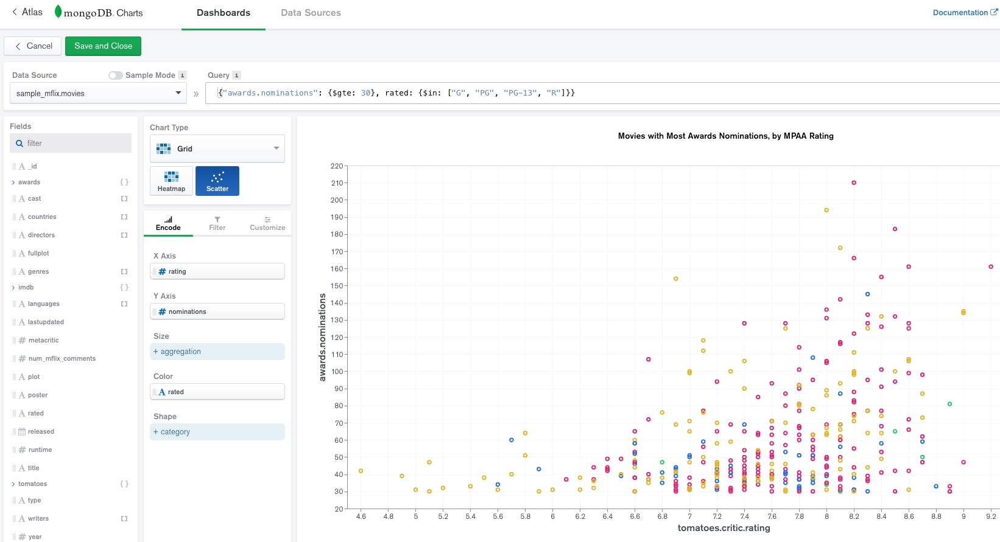  

#### Lab 3 - Embedding MongoDB Charts
If you would like to embed your chart within in existing webpage, that is also
possible with MongoDB Charts.  Follow the guide to [Embed Charts in Your Web Application](https://docs.mongodb.com/charts/master/embedding-charts/).

---
### Code Samples
MongoDB provides a very rich set of APIs for a variety of programming languages.  This includes
everything from C to Go to Java, etc.  The complete list of MongoDB Drivers is available
on the [MongoDB Drivers and ODM](https://docs.mongodb.com/ecosystem/drivers/) page.

A few examples are provided within this repository to assist you in getting a jump start
on developing with MongoDB Atlas.  There is an example for Python, Node.js, and C#.

In fact, feel free to use some of the earlier queries we used in the MongoDB Compass
labs earlier.  MongoDB Compass provides the capability to export queries in a variety
of languages so you can easily copy/paste into your source code.

#### Python
[Python3 Sample](https://github.com/blainemincey/mdb-atlas-workshop-july2019/blob/master/src/python/my_python_app.py)

#### Node.js
[Node.js Sample](https://github.com/blainemincey/mdb-atlas-workshop-july2019/blob/master/src/node/myNodeApp.js)

#### C#
[C# Sample](https://github.com/blainemincey/mdb-atlas-workshop-july2019/blob/master/src/csharp/MyMongoDBApp/Program.cs)


